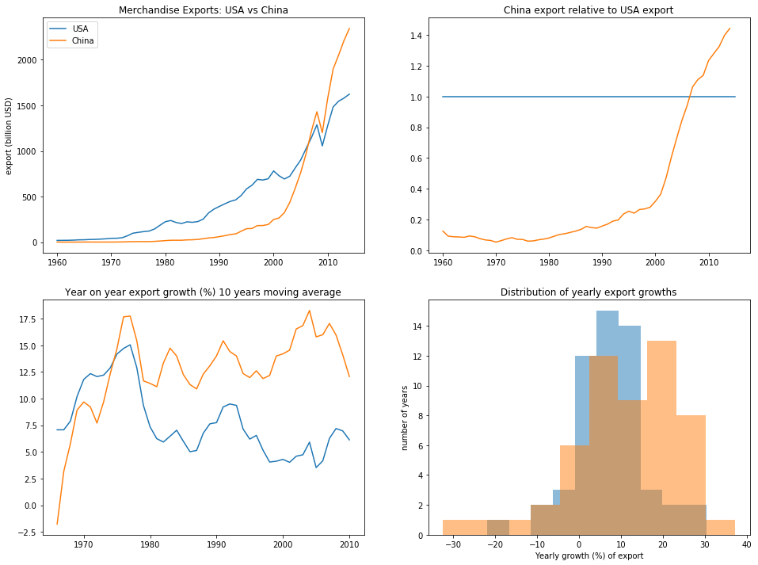

# Merchandise Exports: How China Overtook USA

## Abstract
China's explosion of merchandise export is visualized using data from the Kaggle dataset world-development-indicators.

Using different visualisations we illustrate how China's merchandise exports evolved over the years in comparison to the USA.

Since the late seventies export growth rates of the USA continuously declined while those of China kept increasing. In 2007 China overtook the USA and became the biggest merchandise exporter of the world.

## Motivation
China evolved from a developing country to "The World's Factory".

How did this happen during the past decennia?

By comparing the exports of China with those of the USA (the previous biggest exporting country) over the past decades, we get insight on the pace of growth of
China’s export compared to the USA. 

## Dataset
**Kaggle World Development Indicators Dataset** 

The dataset has 5.656.458 records with historical data form 1960 to 2015 of development indicators of countries. We use the indicator "Merchandise exports (current US$)" (TX.VAL.MRCH.CD.WT) for China and the USA.

https://www.kaggle.com/worldbank/world-development-indicators Indicators.csv

## Data Preparation and Cleaning
* Filter out the data we need: countries USA and CHN, Indicator TX.VAL.MRCH.CD.WT
* Create a new dataframe indexed on year and 2 columns: ExportUSA and ExportCHN
* Add some derived data like export changes, percent changes, and moving averages

## Research Question
* When and how fast China took over the leading role of exporting country?

## Methods
* check the evolution since 2000 to find the tipping point
* plot the yearly evolution of the exports of China and the USA
* plot the China export relative to USA export (how China catched up with the USA)
* plot the 10 year moving average evolution of the year on year export growth to compare USA and China
* plot the distributions of the yearly growth percentages for both countries

## Findings

* 50 years ago the USA exported 10 times as much as China
* In 2007 China overtook the USA as the biggest exporting country
* Since the late seventies export growth rates of the USA continuously declined while those of China kept increasing
* Over the past 30 years China’s average export growth rate was significantly above 10%
* Since 2000 China’s yearly export growth topped 20% in 7 years, the maximum yearly growth for the USA exports in that period was 17%

## Limitations
* Only one indicator was analyzed: merchandise exports. Further analysis could be done by involving more development indicators from the dataset.

## Conclusions
* Over the past decades China's merchandise exports grew much faster than those of the USA and finally China overtook the USA in 2007.

## Acknowledgements
Thanks to Kaggle and the World Bank for making historical development indicators available for research

## References
For other visualisations on global trade:

Global Trade Visualization Tool - http://bit.ly/2uPLYcH
- \#IVMOOC Indiana University project spring 2015 (Corey Abshire, Asimansu Bera, and Ronny De Winter)
- The emergence of China as a world trade leader vs the United States
